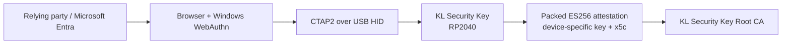

# KL Security Key

[](https://github.com/karaaslanlabs/kl-security-key/actions/workflows/publication-hygiene.yml)
[](LICENSE)

**Experimental open-source RP2040 FIDO2/WebAuthn authenticator engineering and interoperability project by Karaaslan Labs.**

> **Status:** engineering/research project. **Not FIDO Alliance certified.** Not a commercial high-assurance security token.

KL Security Key is a curated derivative of [`polhenarejos/pico-fido`](https://github.com/polhenarejos/pico-fido). It explores how far a low-cost RP2040 board can be taken as a physical WebAuthn authenticator while keeping identity, attestation, validation evidence and trust boundaries explicit.

## At a glance

| Area | Current engineering reference |
| --- | --- |
| Hardware | RP2040 USB development board |
| Transport | USB FIDO HID |
| CTAP/GetInfo versions | `FIDO_2_0`, `FIDO_2_1`, `FIDO_2_3` |
| User presence / verification | Physical button + PIN/UV support |
| Attestation | Packed ES256, `x5c`, device-specific certificate |
| AAGUID | `d9359dc7-6938-5822-b951-006507247d8f` |
| Interoperability | Windows WebAuthn + tenant-local Microsoft Entra validation |
| Distribution | Source-first; no KL firmware binary release |
| Secure element | None |
| Certification | Not FIDO Alliance certified |

## Why this project exists

The project began with a practical question: can an inexpensive development board become a usable physical security key for real WebAuthn sign-in, without hiding the engineering compromises?

The interesting work turned out not to be simply making RP2040 run FIDO2. The harder parts were authenticator identity, physical user presence, attestation, Windows behavior, reproducible source changes, relying-party interoperability and knowing exactly what the evidence does — and does not — prove.

## Verified on the physical reference

- Fresh WebAuthn registration: **PASS**.
- Authentication / GetAssertion with the same credential: **PASS**.
- Windows provider: `MicrosoftCtapHidProvider`.
- CTAP2 path observed with `U2fProtocol=false`.
- Physical user presence required for registration and sign-in.
- PIN/user-verification path validated.
- Packed attestation signature: **PASS**.
- Attestation leaf → KL Security Key Root CA verification: **PASS**.
- AAGUID agreement between authenticator data and certificate extension: **PASS**.
- Microsoft Entra tenant-local device-bound registration and fresh physical-key sign-in: **PASS** with attestation enforcement disabled.

The Entra result is an interoperability result, not Microsoft certification or global authenticator recognition. See [`docs/interoperability-case-study.md`](docs/interoperability-case-study.md) for the exact boundary.

## Architecture



The validated runtime is intentionally narrow: FIDO HID is the security-key interface; unrelated keyboard/CCID-style runtime interfaces are not part of the KL reference profile.

## Build the reference profile

```bash
git clone --recurse-submodules https://github.com/karaaslanlabs/kl-security-key.git
cd kl-security-key
export PICO_SDK_PATH=/path/to/pico-sdk
export PICO_TOOLCHAIN_PATH=/path/to/arm-none-eabi-toolchain
./scripts/build-kl-reference.sh
```

The build enables physical user-presence enforcement, the FIDO-only runtime profile and the packed-attestation path. Valid attestation key/certificate material must be provisioned separately; private attestation keys are not published or auto-provisioned by this repository.

## Trust boundaries and non-claims

This repository does **not** claim:

- FIDO Alliance certification;
- secure-element-level protection against physical key extraction;
- universal relying-party trust, allowlisting or compatibility;
- equivalence to YubiKey, Nitrokey or another commercial security-key vendor;
- Karaaslan Labs ownership of the upstream/project USB VID/PID;
- Microsoft certification or global vendor recognition;
- that protocol-level success with one relying party proves acceptance by another.

Read [`THREAT-MODEL.md`](THREAT-MODEL.md) before treating the reference as anything beyond an engineering/research authenticator.

## Documentation map

| Document | Purpose |
| --- | --- |
| [`docs/architecture.md`](docs/architecture.md) | Runtime profile, source layout and engineering boundaries |
| [`docs/attestation-and-pki.md`](docs/attestation-and-pki.md) | AAGUID, packed attestation and PKI model |
| [`docs/validation-evidence.md`](docs/validation-evidence.md) | Physical-reference and curated-source validation evidence |
| [`docs/interoperability-case-study.md`](docs/interoperability-case-study.md) | Relying-party / Microsoft Entra interoperability evidence and limits |
| [`docs/windows-webauthn-debugging.md`](docs/windows-webauthn-debugging.md) | Evidence-led Windows/WebAuthn debugging workflow |
| [`THREAT-MODEL.md`](THREAT-MODEL.md) | Threat model and security non-claims |
| [`UPSTREAM.md`](UPSTREAM.md) | Upstream provenance and derivative changes |
| [`SECURITY.md`](SECURITY.md) | Vulnerability reporting and security policy |

## Source, provenance and publication model

The `pico-keys-sdk` submodule is pinned to a known upstream commit. KL-specific SDK changes are applied by `scripts/apply-sdk-overlay.py`, which is exact-commit-pinned and fails closed on unexpected source state.

This public repository is intentionally curated around the KL Security Key reference path. Unrelated inherited research artifacts and legacy release helpers are not part of the published KL surface; upstream provenance remains documented in [`UPSTREAM.md`](UPSTREAM.md) and in Git history.

Binary distribution is intentionally not the initial publication target while USB identity/distribution requirements remain unresolved. Source, documentation and validation methodology are the primary artifacts.

The public attestation root certificate is available at [`certs/KL-Security-Key-Root-CA-v1.cert.pem`](certs/KL-Security-Key-Root-CA-v1.cert.pem). Private root/device keys are never published.

## Contributing and security

Contributions are welcome when they are small, auditable and explicit about security impact. Start with [`CONTRIBUTING.md`](CONTRIBUTING.md). Do **not** open a public issue for an unpatched vulnerability; follow [`SECURITY.md`](SECURITY.md).

## License and upstream credit

KL Security Key is derived from `polhenarejos/pico-fido` and uses `polhenarejos/pico-keys-sdk`. The source remains under the GNU Affero General Public License v3.0; see [`LICENSE`](LICENSE), [`NOTICE.md`](NOTICE.md) and [`UPSTREAM.md`](UPSTREAM.md).

Karaaslan Labs does not claim authorship of upstream Pico FIDO / Pico Keys SDK work. Original notices are preserved and KL-specific modifications are documented separately.

## Engineering inquiries

For bounded WebAuthn/passkey debugging or FIDO2 authenticator/attestation engineering inquiries, contact `contact@karaaslanlabs.com`.

Paid debugging service: <https://www.upwork.com/services/product/development-it-get-expert-webauthn-passkey-and-fido2-authentication-debugging-2106330281996723797>. This service covers software/authentication engineering; the physical KL Security Key is **not** offered for sale.

Karaaslan Labs: <https://karaaslanlabs.com>
